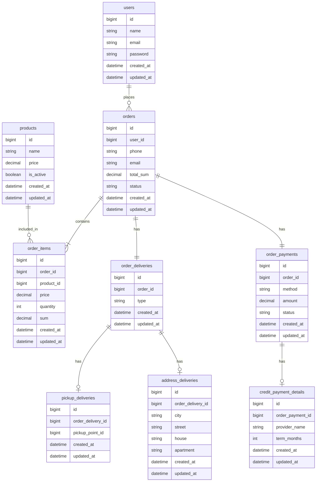
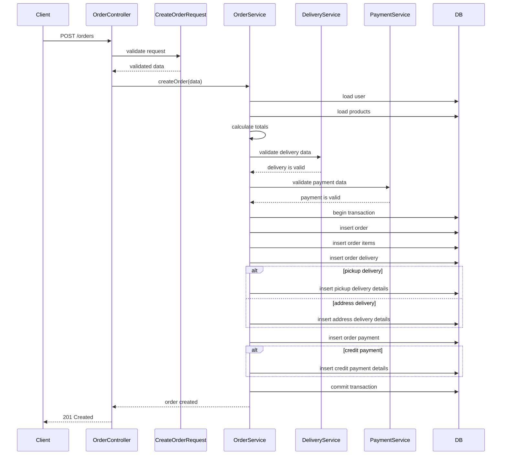

# Тестовое задание: проектирование оформления заказа

## 1. ER-диаграмма

Диаграмма описана в формате Mermaid. 

Корректно отображается в GitHub, GitLab, Mermaid Live Editor и других инструментах с поддержкой Mermaid.



---

## 2. Описание структуры БД

### `orders`

Основная таблица заказов.

| Поле | Описание |
|---|---|
| `id` | Идентификатор заказа |
| `user_id` | Ссылка на пользователя |
| `phone` | Телефон клиента для заказа |
| `email` | E-mail клиента для заказа |
| `total_sum` | Итоговая сумма заказа |
| `status` | Статус заказа |
| `created_at` | Дата создания |
| `updated_at` | Дата обновления |

---

### `order_items`

Товары заказа.

| Поле | Описание |
|---|---|
| `id` | Идентификатор позиции |
| `order_id` | Ссылка на заказ |
| `product_id` | Ссылка на товар |
| `price` | Цена товара на момент заказа |
| `quantity` | Количество |
| `sum` | Итоговая сумма по позиции |

---

### `order_deliveries`

Базовая таблица доставки.

| Поле | Описание |
|---|---|
| `id` | Идентификатор доставки |
| `order_id` | Ссылка на заказ |
| `type` | Тип доставки: `pickup` или `address` |

---

### `pickup_deliveries`

Детали самовывоза.

| Поле | Описание |
|---|---|
| `id` | Идентификатор записи |
| `order_delivery_id` | Ссылка на доставку |
| `pickup_point_id` | Идентификатор пункта выдачи |

---

### `address_deliveries`

Детали доставки на адрес.

| Поле | Описание |
|---|---|
| `id` | Идентификатор записи |
| `order_delivery_id` | Ссылка на доставку |
| `city` | Город |
| `street` | Улица |
| `house` | Дом |
| `apartment` | Квартира |

---

### `order_payments`

Базовая таблица оплаты.

| Поле | Описание |
|---|---|
| `id` | Идентификатор оплаты |
| `order_id` | Ссылка на заказ |
| `method` | Способ оплаты: `card` или `credit` |
| `amount` | Сумма оплаты |
| `status` | Статус оплаты |

---

### `credit_payment_details`

Детали оплаты в кредит.

| Поле | Описание |
|---|---|
| `id` | Идентификатор записи |
| `order_payment_id` | Ссылка на оплату |
| `provider_name` | Название кредитного провайдера |
| `term_months` | Срок кредита в месяцах |

---

### Ограничения и индексы

- foreign key `orders.user_id`;
- foreign key `order_items.order_id`;
- foreign key `order_items.product_id`;
- foreign key `order_deliveries.order_id`;
- foreign key `order_payments.order_id`;
- foreign key `credit_payment_details.order_payment_id`;
- индекс по `orders.user_id`;
- индекс по `orders.status`;
- индекс по `order_items.product_id`;
- check constraint для `quantity > 0`;
- check constraint для `price >= 0`;
- check constraint для `total_sum >= 0`;
- check constraint для `term_months > 0`.

Также желательно обеспечить, чтобы у одного заказа была только одна запись доставки и одна запись оплаты.

---

## 3. Базовая логика оформления заказа

Для упрощения считаем, что существует отдельный бизнес-процесс регистрации пользователя.

Если допустить возможность оформления заказа без регистрации, то возникнет ряд бизнес-вопросов и усложнений.

### Входные данные

Клиент отправляет запрос на оформление заказа.

Пример данных:

```json
{
  "user_id": 1,
  "phone": "+996700000000",
  "email": "user@example.com",
  "items": [
    {
      "product_id": 10,
      "quantity": 2
    },
    {
      "product_id": 15,
      "quantity": 1
    }
  ],
  "delivery": {
    "type": "address",
    "city": "Bishkek",
    "street": "Chuy",
    "house": "100",
    "apartment": "25"
  },
  "payment": {
    "method": "credit",
    "provider_name": "Bank Provider",
    "term_months": 12
  }
}
```

---

### Проверки

Перед сохранением нужно проверить:

- пользователь существует;
- телефон заполнен и имеет корректный формат;
- e-mail заполнен и имеет корректный формат;
- список товаров не пустой;
- все товары существуют в каталоге;
- товары активны и доступны для заказа;
- количество каждого товара больше 0;
- тип доставки является допустимым;
- для самовывоза указан `pickup_point_id`;
- выбранный пункт выдачи существует и активен;
- для доставки на адрес указаны город, улица и дом;
- способ оплаты является допустимым;
- для оплаты в кредит указаны `provider_name` и `term_months`;
- срок кредита больше 0 и входит в допустимый диапазон.

---

### Порядок сохранения

Оформление заказа должно выполняться в DB transaction.

1. Получить входные данные и сделать их валидацию.
2. Загрузить пользователя и товары.
3. Рассчитать цены и итоговую сумму заказа.
4. Начать транзакцию.
5. Создать запись в `orders`.
6. Создать записи в `order_items`.
7. Создать запись в `order_deliveries`.
8. В зависимости от типа доставки создать:
   - `pickup_deliveries`, если выбран самовывоз;
   - `address_deliveries`, если выбрана доставка на адрес.
9. Создать запись в `order_payments`.
10. Если выбран способ оплаты `credit`, создать запись в `credit_payment_details`.
11. Завершить транзакцию.
12. Вернуть клиенту результат оформления заказа.

Если на любом этапе возникает ошибка, откатить транзакцию.

---

## 4. Sequence Diagram

Диаграмма описывает последовательность оформления заказа.



---

## 5. Декомпозиция решения

### Сущности

#### User

Пользователь (клиент), который оформляет заказ.

Может хранить личные данные, контакты и т.д.

#### Product

Товар из каталога.

Используется при оформлении заказа для проверки существования товара, его активности и получения актуальной цены.

В качестве расширения можно добавить сущность `PriceList` для хранения истории изменения цены.

Если требуется хранить историю для других атрибутов товара (например, наименование), можно добавить сущность `ProductVersion`.

#### Order

Основная сущность заказа.

Хранит ссылку на пользователя, контактные данные, итоговую сумму и статус заказа.

Контактные данные хранятся в заказе для истории, если они будут изменяться, и для упрощения фильтрации заказов по этим данным.

#### OrderItem

Позиция товара в заказе.

Хранит товар, количество, цену на момент оформления заказа.

Цена хранится в заказе для истории, для упрощения расчета суммы, защиты от изменения каталога, поддержки скидок и акций.

В качестве расширения можно добавить сущность `Discount`, тогда могут появиться поля Процент скидки, Сумма скидки.

#### OrderDelivery

Базовая сущность доставки заказа.

Хранит тип доставки: самовывоз или доставка на адрес.

Данная сущность добавлена для соответствия принципу SPR, упрощения расширения, хранения общих полей доставки при необходимости.

#### PickupDelivery

Детали доставки для самовывоза.

Хранит идентификатор пункта выдачи.

#### AddressDelivery

Детали доставки на адрес.

Хранит город, улицу, дом и квартиру.

#### OrderPayment

Базовая сущность оплаты заказа.

Хранит способ оплаты, сумму и статус оплаты.

Причина добавления данной сущности аналогична `OrderDelivery`, плюс оплата обычно имеет свой жизненный цикл, возможна интеграция с платежными системами.

#### CreditPaymentDetails

Дополнительные данные для оплаты в кредит.

Используется только если выбран способ оплаты `credit`.

---

### Зоны ответственности

#### OrderService

Главный сервис сценария оформления заказа.

Отвечает за:

- координацию процесса создания заказа;
- запуск и завершение транзакции;
- вызов сервисов доставки и оплаты;
- создание заказа и связанных сущностей;
- расчет итоговой суммы.

#### DeliveryService

Отвечает за бизнес-процесс доставки.

#### PaymentService

Отвечает за бизнес-процесс оплаты.

#### Repositories

Отвечают за работу с БД:

- `OrderRepository`;
- `OrderItemRepository`;
- `DeliveryRepository`;
- `PaymentRepository`.

Их задача — изолировать сохранение и получение данных от бизнес-логики.

#### Models

Отвечают за представление таблиц БД в приложении и связей между ними.

Например:

- `Order`;
- `OrderItem`;
- `OrderDelivery`;
- `OrderPayment`.

#### HTTP Request / Validation

Отвечает за первичную проверку входных данных:

- обязательные поля;
- формат телефона и e-mail;
- тип доставки;
- способ оплаты;
- наличие данных, обязательных для выбранного типа доставки или оплаты.

#### DTO

Отвечает за передачу уже структурированных данных внутри приложения.

Например:

- `CreateOrderData`;
- `DeliveryData`;
- `PaymentData`.

#### Enums

Отвечают за фиксированный набор значений:

- `DeliveryType`: `pickup`, `address`;
- `PaymentMethod`: `card`, `credit`;
- `OrderStatus`: `created`, `paid`, `cancelled`;
- `PaymentStatus`: `pending`, `paid`, `failed`.

Enums уменьшает риск ошибок из-за строковых значений.

#### Resources / Response

Отвечают за формат ответа API.

Например, после успешного оформления заказа можно вернуть:

- `order_id`;
- статус заказа;
- итоговую сумму;
- информацию о доставке;
- информацию об оплате.

---

## 6. Примеры возможностей для расширения

- новые типы доставки, например постамат;
- новые способы оплаты, например PayPal;
- отдельная сущность для кредитных провайдеров;
- промокоды и скидки;
- история изменения статусов заказа;
- проверка остатков товаров на складе;
- отдельная сущность с данными для оплаты по карте;
- интеграция с внешней платежной системой.
